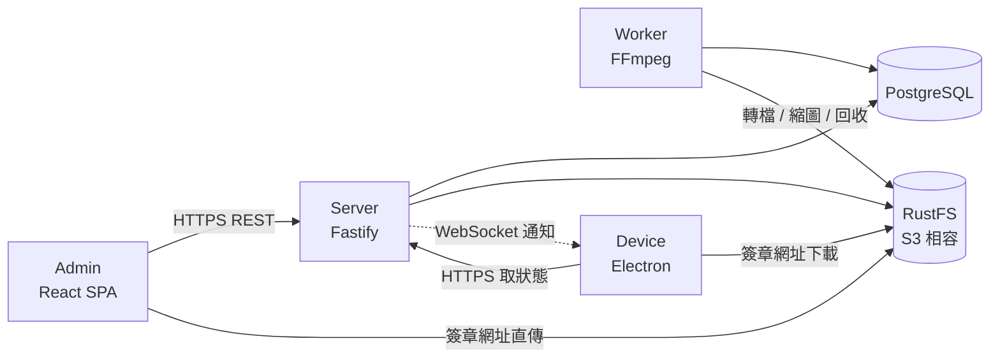
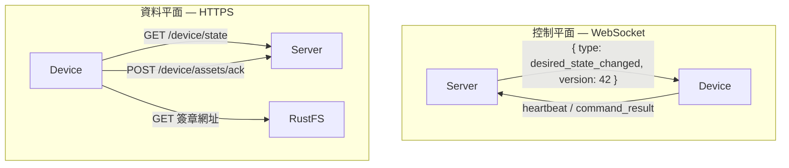

<div align="center">

# HUAN 讙

**跨平台的雲端媒體播放與數位看板系統**

支援影片、圖片與文字內容，並可從遠端集中上傳、排程、同步與管理多台播放裝置。

</div>

---

## HUAN 是什麼

HUAN 讙讓你在瀏覽器裡設計一面畫面，然後把它送到現場的螢幕上。

你在後台上傳影片與圖片、把畫布切成幾塊、放上文字與跑馬燈、設定星期一到星期五早上播哪一版，接著把內容發布出去。現場的 Raspberry Pi、Windows、Ubuntu 或 macOS 播放器會自己下載素材、驗證雜湊、在全部準備好之後才切換版本。

**網路斷了，畫面照播。** 這是 HUAN 最重要的設計目標：素材永遠先下載到裝置本機，排程也存在裝置上，Server 離線時裝置依然會依時間切換版面。

## 架構



控制平面與資料平面刻意分開：



WebSocket 只說「有東西變了」，從不傳輸素材。真正的狀態一律回到 REST API 取得。

## 需求

| 項目    | 版本                                         |
| ------- | -------------------------------------------- |
| Node.js | 24 LTS（見 `.nvmrc`）                        |
| pnpm    | 12（`corepack enable pnpm`）                 |
| Docker  | 用於 PostgreSQL、RustFS 與正式部署           |
| FFmpeg  | 只有在本機直接跑 Worker 或 Worker 測試時需要 |

## 快速開始

```sh
# 1. 安裝相依套件
pnpm install

# 2. 準備環境變數（請自行更換其中的密碼）
cp .env.example .env

# 3. 啟動 PostgreSQL 與 RustFS
pnpm docker:up

# 4. 建立資料表
pnpm db:migrate

# 5. 建立第一個最高權限管理員（互動式，不會有預設密碼）
pnpm --filter @huan/server admin:create

# 6. 啟動 Server、Worker 與 Admin
pnpm dev
```

Admin 開發站台在 <http://localhost:5173>，API 在 <http://localhost:4000>。

想要一組可以直接點的示範資料：

```sh
pnpm db:seed
```

種子資料的帳號密碼只供開發使用，執行時會在終端機印出明確警告。

## 開發

```sh
pnpm dev              # server + worker + admin
pnpm dev:server       # 只跑 Fastify
pnpm dev:admin        # 只跑 Vite
pnpm dev:worker       # 只跑 FFmpeg worker
pnpm dev:device       # 啟動 Electron 播放器
pnpm dev:device-sim   # 啟動模擬裝置（不需要 Raspberry Pi）

pnpm typecheck
pnpm test
pnpm test:e2e
pnpm build
pnpm format
```

`packages/*` 是共用套件，`apps/*` 依賴它們的建置產物，因此 `pnpm dev` 與 `pnpm test` 都會先跑 `pnpm build:packages`。

`pnpm docker:up` 會一併啟動 `server` 容器，和 `pnpm dev` 搶同一個 4000 埠。本機開發時只啟動資料庫與物件儲存即可：

```sh
docker compose -f docker/compose.yaml up -d postgres rustfs
```

## Docker 部署

```sh
cp .env.example .env      # 設定 POSTGRES_PASSWORD、S3_SECRET_ACCESS_KEY、PUBLIC_URL
pnpm docker:build
pnpm docker:up
docker compose -f docker/compose.yaml exec server node apps/server/dist/cli/migrate.js
docker compose -f docker/compose.yaml exec -e HUAN_ADMIN_PASSWORD=... server \
	node apps/server/dist/cli/create-admin.js --email you@example.com --username admin --display-name 管理員
```

`compose.yaml` 會啟動 `postgres`、`rustfs`、`server` 與 `worker`。Admin 的 production build 由 Server 直接靜態提供，不需要額外的容器。每個服務都有 healthcheck、restart policy 與具名 volume，且都以非 root 使用者執行。

詳細的環境變數說明見 [`.env.example`](.env.example) 與文件的「部署」章節。

## Device

播放器是 Electron 應用程式，支援：

| 平台                   | 架構       |
| ---------------------- | ---------- |
| Raspberry Pi OS 64-bit | arm64      |
| Ubuntu                 | x64、arm64 |
| Windows                | x64、arm64 |
| macOS                  | x64、arm64 |

```sh
pnpm dev:device                        # 本機開發（視窗模式）
pnpm --filter @huan/device package:linux
pnpm --filter @huan/device package:win
pnpm --filter @huan/device package:mac
```

第一次啟動會顯示 `XXXX-XXXX` 配對碼與 QR Code。用已登入的後台掃碼或輸入配對碼即可綁定。綁定後裝置本機只提供裝置資訊、連線狀態與解除綁定，內容一律由後台控制。

不想準備實體裝置時，`pnpm dev:device-sim` 會啟動一個完整走完配對、同步、下載、校驗與回報流程的模擬裝置。

## 文件

```sh
pnpm docs:dev          # 本機文件站
pnpm docs:build        # SSG 建置到 apps/docs/doc_build
pnpm docs:screenshots  # 以 Playwright 對種子環境重新擷取產品截圖
```

文件以 Rspress 建置並部署到 GitHub Pages，同時產生 `llms.txt`、`llms-full.txt` 與每頁的 Markdown，方便 AI 工具閱讀。

## 測試

```sh
pnpm test        # 共用套件單元測試、Server 整合測試、Worker FFmpeg 測試、Admin 元件測試
pnpm test:e2e    # Playwright 端對端流程
```

Server 與 Worker 的測試需要 PostgreSQL 與 RustFS，請先 `pnpm docker:up`。缺少環境時測試會明確跳過並說明原因，不會假裝通過。Worker 的測試素材由 FFmpeg 的 `testsrc` 即時產生，repository 內不放任何大型或有版權的影片。

## 一個必須誠實說明的取捨

**HUAN 不會永久保存你上傳的原始檔。**

原始影片在轉檔成功後就會刪除，派送用的播放產物在所有目標裝置都完成 ACK 並經過保留期後也會回收。正式的播放副本存在裝置本機。

因此，如果原始檔已刪除、播放產物也已回收，而你後來新增了一台裝置或清掉了舊裝置的本機儲存，該素材會被標記為 **需要重新上傳**。後台會直接這樣顯示，不會假裝伺服器還留著不存在的檔案。

## 授權條款

本專案採用 [Apache License 2.0](LICENSE)。
