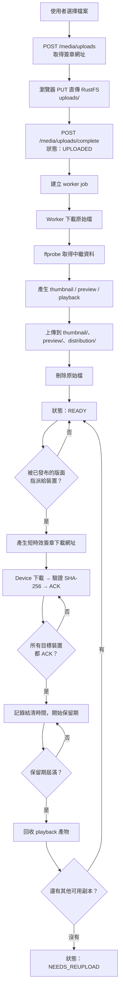

# 素材生命週期

這一章描述一個檔案從上傳到被回收的完整過程，以及 HUAN 在儲存上刻意做的取捨。

## 完整流程

## 儲存命名空間

RustFS 裡的物件依用途分成幾個前綴：

| 前綴            | 內容                         | 保留策略                          |
| --------------- | ---------------------------- | --------------------------------- |
| `uploads/`      | 使用者上傳的原始檔           | 轉檔成功後立即刪除                |
| `processing/`   | Worker 的中間產物            | 工作結束即刪除                    |
| `thumbnail/`    | 素材庫縮圖                   | 長期保留（很小）                  |
| `preview/`      | 後台排版預覽用的低解析度版本 | 長期保留                          |
| `distribution/` | 派送到裝置的播放檔           | 所有目標裝置 ACK 且過保留期後回收 |

**物件鍵一律由 UUID 組成，永遠不使用使用者提供的檔名。**

一個叫 `../../etc/passwd.mp4` 的上傳檔案不會變成路徑問題，因為那個名字只會被存成中繼資料裡的一個字串，從來不會出現在物件鍵裡。副檔名由 content type 推導，不是從檔名擷取。

## 為什麼原始檔會被刪除

一支 4K 的原始影片可能有 8 GB。轉檔後的 1080p 播放檔可能只有 200 MB。如果原始檔永久保存，物件儲存的成本會隨著上傳量線性成長，而那些原始檔在系統裡沒有任何用途——播放用的是轉檔後的版本，預覽用的是預覽版本。

所以 HUAN 在轉檔成功後就刪除原始檔。這是刻意的產品決定，理由完整寫在 [ADR-0003](/architecture/adr/0003-temporary-object-storage)。

## 為什麼播放產物也會被回收

同樣的道理再往前一步：正式的播放副本最終保存在**裝置本機**。當所有目標裝置都下載完成並回報 ACK 之後，RustFS 上那份 `distribution/` 的副本就沒有讀者了。

回收前有兩道保護：

1. **必須所有目標裝置都 ACK**。第一台下載成功就刪除，第二台就永遠拿不到了。
2. **必須經過保留期**（預設 24 小時，`DISTRIBUTION_RETENTION_HOURS`）。這段緩衝是為了吸收 ACK 與重試之間的競態——裝置可能剛回報成功就重開機並重新下載，也可能有一台裝置的 ACK 因為網路問題晚了幾分鐘才到。

## 需要重新上傳

::: warning 這是產品的真實限制，不是 bug HUAN 不永久保存完整的播放素材。:::

當下列情況同時成立：

- 原始檔已在轉檔後刪除
- `distribution/` 的播放產物已在所有裝置 ACK 後回收
- 而你現在需要重新派送這份素材（新增了一台裝置、或某台裝置清掉了本機儲存）

RustFS 上就不再有可以派送的版本。這時素材會被標記為 **需要重新上傳**（`NEEDS_REUPLOAD`），後台會直接這樣顯示。

系統不會假裝檔案還在，也不會在派送時才發現失敗。資料模型本身就能表達這個狀態：每個 `media_variants` 資料列都有 `available` 欄位，物件被回收後轉為 `false`，資料列保留下來，讓 UI 能解釋素材為什麼需要重新上傳。

### 怎麼避免

- 把 `DISTRIBUTION_RETENTION_HOURS` 調長。設成 `720`（30 天）就等於「一個月內都還能重新派送」。
- 在既有裝置還在線上時就先完成新裝置的配對與同步。
- 對於重要的長期素材，在自己這邊保留一份原始檔備份。HUAN 是播放系統，不是資產管理系統。

## 影片轉檔目標

目標是產生「小、通用、Raspberry Pi 也放得動」的檔案。

| 項目       | 設定                             |
| ---------- | -------------------------------- |
| 容器       | MP4                              |
| 視訊       | H.264（High profile, level 4.0） |
| 像素格式   | `yuv420p`                        |
| 最大解析度 | 1920×1080                        |
| 最大影格率 | 30 fps                           |
| 音訊       | AAC                              |
| Fast start | 啟用（`-movflags +faststart`）   |

**不做放大。** 一支 640×360 的來源檔轉出來還是 640×360，把它拉成 1080p 只會讓檔案變大、畫質不變。長寬比一律保持原樣。

`yuv420p` 是刻意指定的：某些來源使用 `yuv444p` 或 10-bit 格式，Raspberry Pi 的硬體解碼器不支援，播放時會退回軟體解碼並卡頓。

## 圖片處理

圖片上傳後同樣產生三種產物。播放版本會限制在合理尺寸——不能讓 Raspberry Pi 每次算繪都去解一張 12000×9000 的原圖。

長寬比保持不變。來源含有 alpha 通道時，播放版本會保留透明資訊，不會被壓成黑底。

## HTML

第一版只支援**單一自帶資源的 HTML 檔案**。需要圖片時請用 `data:` URI 內嵌。完整的網站 ZIP 代管不在這一版的範圍內。

上傳的 HTML 在裝置上以 sandbox iframe 執行，沒有 Node、沒有檔案系統、沒有 Electron API。詳見 [Device 架構](/architecture/device)。
