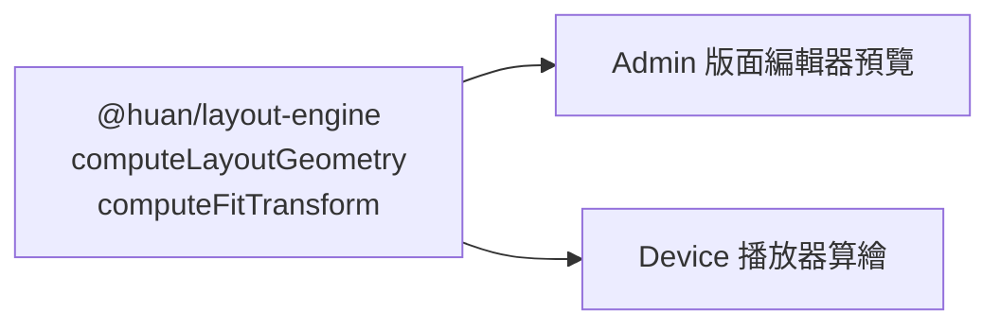

# 版面與縮放

## 遞迴分割樹

HUAN 的版面不是自由拖曳的絕對定位畫布，而是一棵遞迴分割樹。

```ts
type LayoutNode =
	| {
			type: "split";
			id: string;
			direction: "horizontal" | "vertical";
			ratio: number;
			first: LayoutNode;
			second: LayoutNode;
	  }
	| {
			type: "slot";
			id: string;
			content: SlotContent | null;
	  };
```

任何區塊都可以被水平或垂直切成兩塊，切出來的每一塊又都可以繼續切。

```text
root（水平分割 0.7）
├─ first  → 影片（畫面左側 70%）
└─ second（垂直分割 0.5）
   ├─ first  → 標題文字（右上）
   └─ second → 跑馬燈（右下）
```

### 方向的定義

`direction` 描述的是**兩個子區塊怎麼排**，不是分隔線的方向：

- `horizontal`：兩塊水平並排，`first` 在左、`second` 在右。
- `vertical`：兩塊垂直堆疊，`first` 在上、`second` 在下。

這和 CSS 的 `flex-direction: row / column` 是同一種直覺。

### 為什麼是比例而不是像素

`ratio` 是 0 到 1 之間的比例，不是固定的 px 寬度。

一份 1920×1080 的版面裡，70/30 的分割在 1920 寬時是 1344/576。同一份版面放到 1280×720 的螢幕上，仍然是 70/30——896/384。如果存的是「左邊 1344px」，換一台螢幕就整個歪掉。

比例也有下限與上限（0.05 到 0.95）。沒有這個限制，使用者一不小心就會拖出 0.001 / 0.999 這種再也點不回來的版面。

完整理由見 [ADR-0004](/architecture/adr/0004-recursive-split-layout)。

## 間距

`gap` 的單位是**設計畫布的 px**，會跟著畫布一起等比縮放。

間距是從可用空間裡扣掉的，不是加在外面：不論分幾層，所有區塊的外緣永遠貼齊畫布邊界，只有區塊之間有間距。

```text
容器寬 1000、gap 20、ratio 0.5
→ 左塊 x=0   寬 490
→ 右塊 x=510 寬 490
→ 右緣 510 + 490 = 1000 ✓
```

## 縮放策略

設計畫布的尺寸和實體螢幕往往不同。HUAN 的策略是 **contain**：

```text
scale = min(螢幕寬 / 畫布寬, 螢幕高 / 畫布高)
```

整份畫布等比縮放並置中，長寬比不同時剩下的區域填入版面背景色。

**不做拉伸。** 一份 16:9 的版面放到 4:3 的螢幕上，會上下（或左右）留邊，而不是把所有東西壓扁。變形的看板比黑邊難看得多，而且客戶不會知道問題出在自己選錯解析度還是系統壞了。

| 畫布      | 螢幕      | 結果                    |
| --------- | --------- | ----------------------- |
| 1920×1080 | 1280×720  | 完整填滿，scale = 0.667 |
| 1920×1080 | 1000×1000 | 上下留邊，內容高 562.5  |
| 1080×1920 | 1920×1080 | 左右留邊，內容寬 607.5  |

## 一份實作，兩個地方使用

`@huan/layout-engine` 同時被後台預覽與裝置播放器使用：



這不是為了少寫程式碼，而是為了**保證兩邊完全一致**。如果後台自己算一套、裝置再算一套，遲早會出現「後台看起來是 70/30，實機顯示變成 68/32」這種沒人查得出來的偏差。

幾何計算有針對 1920×1080、1280×720、3840×2160 與 1080×1920 的單元測試，斷言的是實際數值——70/30 在 1920 寬上就是 1344 與 576，不多不少。

## 版面修訂

發布不會覆蓋現有內容，而是建立一筆**不可變的修訂**：

```text
版面 3
├─ 修訂 12（2026-08-01 發布）
├─ 修訂 13（2026-08-14 發布）
└─ 修訂 14（2026-09-02 發布）← 目前
```

草稿與已發布版本完全分離。你可以放心編輯草稿，現場播的還是上一次發布的內容。

裝置的目標狀態指向的是**修訂 id**，不是版面 id。這讓下列事情變得可行：

- 稽核：知道某台裝置在某個時間點播的是哪一版
- 回溯：把裝置指回舊的修訂
- 版本判斷：裝置能明確知道自己是不是落後
- 原子更新：修訂內容不會在裝置下載到一半時被改掉
