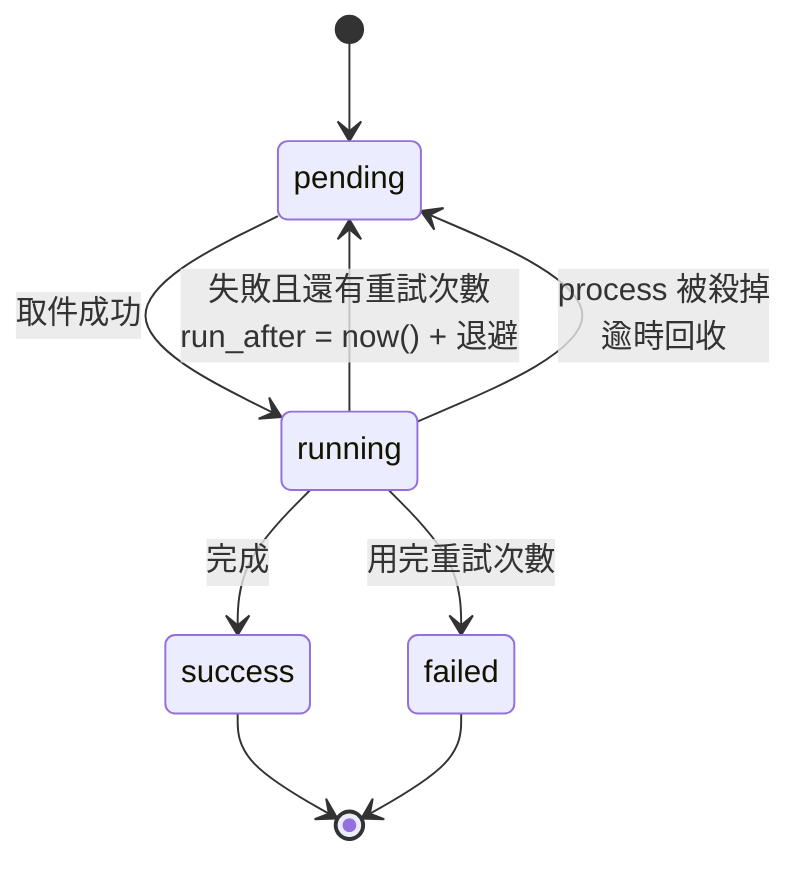

# Worker

獨立的 process、獨立的容器。

## 為什麼要獨立

FFmpeg 轉一支 1080p 的影片可能要好幾分鐘，而且會把 CPU 吃滿。這件事跑在 Fastify 裡會有兩個後果：轉檔期間 API 完全沒有回應；而且要擴充轉檔能力就必須連 API 一起擴充。

分開之後，Server 只負責把工作寫進資料表，Worker 自己去取。要加快轉檔就多開幾個 Worker 容器，Server 完全不用動。

## 工作佇列就是一張資料表

```sql
SELECT * FROM worker_jobs
WHERE status = 'pending' AND run_after <= now()
ORDER BY run_after, created_at
FOR UPDATE SKIP LOCKED
LIMIT 1;
```

`FOR UPDATE SKIP LOCKED` 是 PostgreSQL 內建的佇列原語：取件的交易會鎖住那一列，其他 Worker 直接跳過它去拿下一件。不需要 Redis，也不需要外部的訊息佇列（[ADR-0007](/architecture/adr/0007-postgres-job-queue)）。

### 狀態機



每一筆工作都記錄 `attempt`、`max_attempts`、`error`、`started_at`、`finished_at` 與 `run_after`。

重試使用指數退避。被強制終止的 Worker 留下的 `running` 工作會在逾時後被回收成 `pending`，不會永遠卡住。

## 工作種類

| 種類                   | 內容                                    |
| ---------------------- | --------------------------------------- |
| `transcode_video`      | ffprobe → 轉檔 → 縮圖 → 預覽 → 播放版本 |
| `process_image`        | 尺寸限制、縮圖、預覽、播放版本          |
| `process_html`         | 驗證、大小限制、複製為播放版本          |
| `cleanup_distribution` | 回收已結清且過保留期的播放產物          |

## FFmpeg 的呼叫方式

**一律使用 `spawn` 加參數陣列，永遠不拼接 shell 字串。**

```ts
spawn(ffmpegPath, ["-i", inputPath, "-c:v", "libx264", "-pix_fmt", "yuv420p", outputPath]);
```

這是硬性的安全要求。使用者可以控制檔名與中繼資料，只要有一個地方把它們接進 shell 字串，就變成命令注入。參數陣列從根本上讓這件事不可能發生。

實際上 Worker 連檔名都不會傳給 FFmpeg——輸入輸出都是 Worker 自己在暫存目錄裡產生的 UUID 路徑。

## 錯誤訊息

工作最終失敗時，資料庫裡存的是一句給使用者看的中文說明：

```text
影片轉檔失敗，來源檔案可能損毀或格式不支援。
```

完整的 FFmpeg 指令、stderr 與檔案系統路徑只留在結構化日誌裡。一般使用者不需要看到 `/var/tmp/huan/9f3a.../input.mkv`，那對他們沒有幫助，還洩漏了伺服器的內部結構。

## 日誌

每一行工作日誌都帶著 `jobId`、`assetId` 與 `kind`。

**不記錄簽章網址**——那些網址的查詢字串裡就是憑證。日誌記的是物件鍵。
