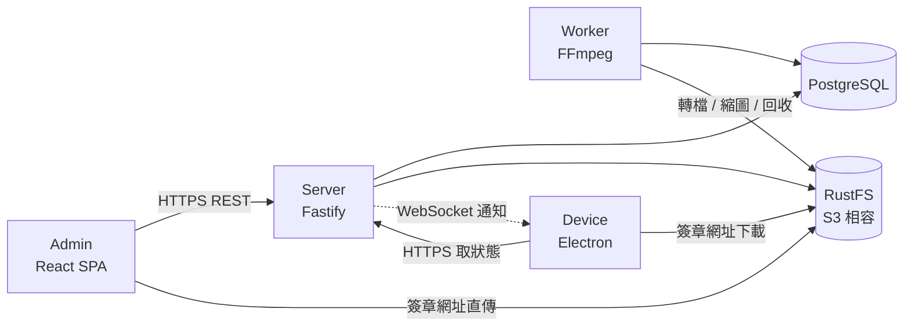
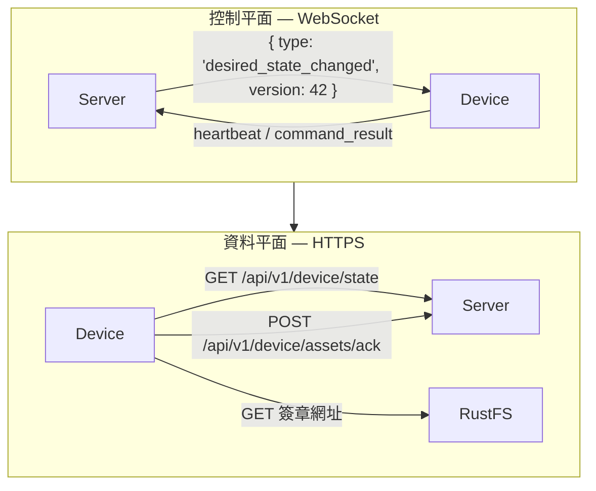
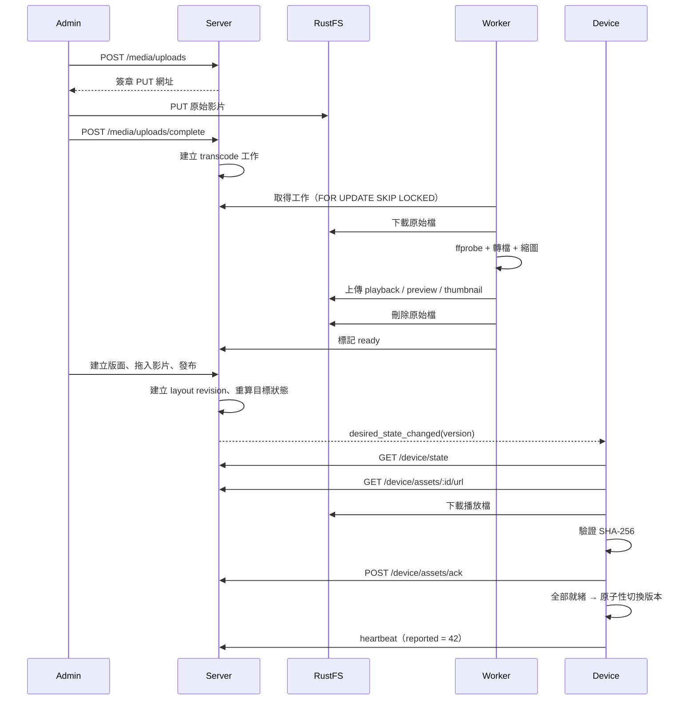

# 系統架構

HUAN 由五個執行中的元件與兩個儲存後端組成。

## 控制平面與資料平面

HUAN 刻意把「通知」與「資料」分開。

WebSocket 傳的訊息永遠很小，而且只表達「有東西變了」。真正的狀態一律回到 REST API 取得——**REST 才是唯一的事實來源**。

這樣做的理由見 [ADR-0001](/dev/adr/0001-websocket-plus-rest)。

## 為什麼不是每 10 秒問一次

一台裝置每 10 秒完整拉一次狀態，一百台就是每秒十次全量查詢，而其中九成九的回應內容完全相同。

HUAN 用的是：

- **WebSocket 通知**：有變化時立刻推播，延遲接近零。
- **每 5 分鐘的保底同步**：推播漏掉時仍會補上，不完全依賴長連線。
- **約 60 秒的 heartbeat**：回報實際狀態並確認裝置還活著。

斷線後以指數退避加抖動重連（1s → 2s → 4s → … → 60s 上限）。抖動不是裝飾：整個賣場的看板同時斷線時，沒有抖動就會在同一秒一起重連，把剛恢復的 Server 再打掛一次。

## 資料流：從上傳到播放

## 元件職責

### Admin

React 19 單頁應用程式，用 Vite 建置，不做伺服器端算繪。TanStack Query 管理伺服器狀態，React Router 管理路由。版面編輯器的預覽用的是 `@huan/layout-engine`——和 Device 播放器完全同一套幾何計算，因此後台看到 70/30，實機就是 70/30。

大型檔案不經過 Fastify：Admin 向 Server 換一組簽章網址，然後瀏覽器直接 PUT 到 RustFS。

### Server

Fastify 5，所有路由都用 `@huan/protocol` 的 zod 結構驗證，OpenAPI 由同一份結構自動產生，不會出現文件與實作不同步的情況。

Server 負責帳號、session、TOTP、裝置憑證、配對、素材中繼資料、版面修訂、排程、目標狀態計算、簽章網址與稽核紀錄。

### Worker

獨立的 process 與獨立的容器。FFmpeg 轉一支 1080p 影片可能要好幾分鐘，這件事絕對不能跑在 Fastify 的事件迴圈裡。

工作佇列就是 PostgreSQL 的一張表，用 `SELECT ... FOR UPDATE SKIP LOCKED` 取件。這個 MVP 不需要 Redis（[ADR-0007](/dev/adr/0007-postgres-job-queue)）。

### Device

Electron 應用程式，主行程負責身分、API、WebSocket、下載佇列、排程與本機儲存；算繪行程只負責畫面。算繪行程沒有 Node 權限（`nodeIntegration: false`、`contextIsolation: true`、`sandbox: true`），上傳的 HTML 在再一層 sandbox iframe 裡執行。

同步引擎在 `@huan/device-core`，是純 Node 程式庫，因此可以完全不用 Electron 就跑起來——這也是模擬裝置能存在的原因。

## 共用套件

| 套件                  | 內容                                      | 使用者                |
| --------------------- | ----------------------------------------- | --------------------- |
| `@huan/protocol`      | 所有 API、WebSocket、版面、排程、裝置結構 | 全部                  |
| `@huan/db`            | Drizzle schema、連線、migration           | Server、Worker        |
| `@huan/shared`        | 排程判定、退避、格式化、TOTP              | Server、Device、Admin |
| `@huan/layout-engine` | 分割樹幾何、縮放、樹狀操作                | Admin、Device         |
| `@huan/config`        | 環境變數結構與驗證                        | Server、Worker        |
| `@huan/device-core`   | 裝置同步引擎                              | Device、模擬裝置      |

型別只定義一次。Admin、Server 與 Device 不會各自維護一份會漂移的介面。
