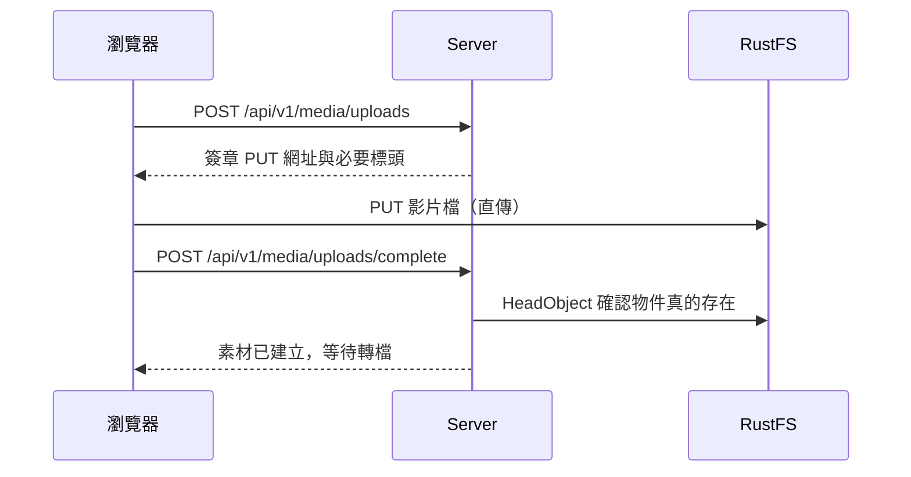

# RustFS

RustFS 是 HUAN 使用的 S3 相容物件儲存。

## 它不是永久素材庫

::: warning 這一點決定了整個儲存模型 RustFS 在 HUAN 裡是**暫存與派送**用的，不是資產庫。正式的播放副本最終保存在裝置本機。:::

它負責五件事：

1. 原始檔的短暫暫存
2. FFmpeg Worker 的輸入與輸出
3. 後台的預覽
4. 縮圖
5. 裝置下載前的暫時派送

完整理由見 [ADR-0003](/dev/adr/0003-temporary-object-storage)。

## 命名空間

| 前綴            | 內容                     | 保留                      |
| --------------- | ------------------------ | ------------------------- |
| `uploads/`      | 使用者上傳的原始檔       | 轉檔成功後刪除            |
| `processing/`   | Worker 的中間產物        | 工作結束即刪除            |
| `thumbnail/`    | 素材庫縮圖               | 長期                      |
| `preview/`      | 後台預覽用的低解析度版本 | 長期                      |
| `distribution/` | 派送到裝置的播放檔       | 全部 ACK 且過保留期後回收 |

## 物件鍵

**物件鍵一律由 UUID 組成，永遠不使用使用者提供的檔名。**

```text
distribution/9f3a7c21-…/4b8e0d13-….mp4
```

副檔名由 content type 推導，不是從上傳的檔名擷取。

一個叫 `../../etc/passwd.mp4` 的上傳檔案不會變成路徑穿越問題，因為那個名字只會被存成中繼資料裡的一個字串。同名檔案也不會互相覆蓋。

## 直傳

大型檔案不經過 Fastify：



一支 4 GB 的影片如果經過 Node.js 的記憶體，只要幾個人同時上傳就會把 Server 打掛。直傳讓 Server 只處理幾百位元組的中繼資料。

`complete` 步驟會用 `HeadObject` 確認物件真的存在——不能只相信瀏覽器說它上傳成功了。

## 設定

```sh
S3_ENDPOINT=http://rustfs:9000          # Server 與 Worker 用
S3_PUBLIC_ENDPOINT=https://storage.example.com   # 瀏覽器與裝置用
S3_REGION=us-east-1
S3_BUCKET=huan
S3_ACCESS_KEY_ID=…
S3_SECRET_ACCESS_KEY=…
S3_FORCE_PATH_STYLE=true
```

`S3_FORCE_PATH_STYLE` 必須是 `true`。RustFS 使用 path-style 位址（`http://host/bucket/key`），不是 virtual-hosted style（`http://bucket.host/key`）。

儲存桶會在 Server 啟動時自動建立（如果不存在的話）。

## 簽章網址

所有對外的存取都透過短時效的簽章網址，預設 15 分鐘（`SIGNED_URL_TTL_SECONDS`）。

- 網址不會被儲存在資料庫裡，每次讀取時即時產生。
- 網址不會寫進任何日誌——查詢字串本身就是憑證。
- 裝置遇到過期的網址時會重新索取，**不會讓整次同步失敗**。

## 替換成其他 S3 相容儲存

HUAN 用的是標準的 S3 API（`PutObject`、`GetObject`、`HeadObject`、`DeleteObject` 與預簽章網址），因此可以換成 MinIO、Ceph RGW、AWS S3、Cloudflare R2 等等。

只要改 `S3_ENDPOINT`、憑證與 `S3_FORCE_PATH_STYLE`（AWS S3 與 R2 要設為 `false`）。
