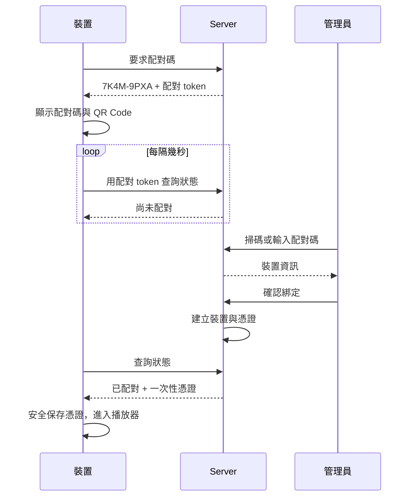

# 配對

裝置第一次啟動時還不屬於任何帳戶。配對就是把它綁定到你的 HUAN 的過程。

## 裝置端

啟動後畫面顯示：

```text
HUAN
讙

7K4M-9PXA
```

以及一個 QR Code。

<figure class="huan-figure">
	
	<figcaption>裝置端的配對畫面</figcaption>
</figure>

## 後台端

用已登入的瀏覽器掃描 QR Code，或直接到 `/pair` 手動輸入配對碼。

確認畫面會顯示這台裝置回報的名稱、平台、架構與 App 版本，讓你確定綁的是眼前這一台。可以順便重新命名並指定預設版面。

按下綁定之後，裝置畫面會顯示「已綁定」並進入播放器。

## 流程



## 配對碼

- 8 個字元，顯示成 `XXXX-XXXX`
- 密碼學隨機產生，不可預測
- 10 分鐘過期
- 只能使用一次
- 字母表排除 0、O、1、I

排除易混淆字元是因為這串字要被人從牆上的螢幕抄到手機或電腦裡。

## 為什麼有兩個秘密

配對碼給人看，配對 token 給裝置用。

裝置在要求配對碼的同時會拿到一個配對 token，只有持有這個 token 的裝置能領取配對結果。

這表示**即使有人猜到或看到配對碼，也搶不走那組憑證**——他可以完成綁定，但憑證只會交給發起配對的那一台裝置。

## 裝置憑證

配對完成後，裝置取得一組**專屬的憑證**。

- 每台裝置各自獨立，不共用秘密。撤銷一台不影響其他台。
- Server 只保存憑證的 SHA-256，**憑證原值只在配對當下回傳一次**。
- 憑證在裝置上使用作業系統提供的加密能力保存（Electron 的 `safeStorage`），不以明文寫在設定檔裡。
- 憑證不會出現在任何日誌或稽核紀錄中。

## 配對碼過期了

重新啟動裝置就會產生新的一組。

## 已綁定的裝置能做什麼

**不能在裝置本機修改版面、素材或排程。** 內容一律由後台控制。

本機只提供：

- 裝置基本資訊
- 網路與連線狀態
- 配對狀態
- 解除綁定

透過系統匣、選單或鍵盤快捷鍵開啟，不影響正常播放。
