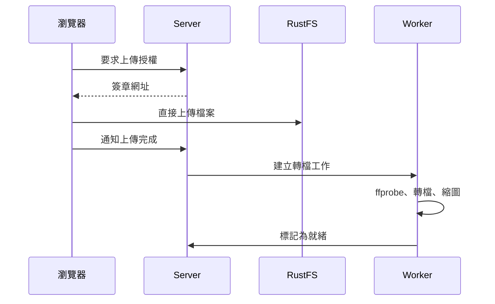

# 上傳素材

`/app/media` 是素材庫。

<figure class="huan-figure">
	
	<figcaption>素材庫</figcaption>
</figure>

## 可以上傳什麼

| 類型 | 格式                           |
| ---- | ------------------------------ |
| 影片 | MP4、MOV、MKV、WebM、MPEG、AVI |
| 圖片 | JPEG、PNG、WebP、AVIF、GIF     |
| HTML | 單一自帶資源的 `.html`         |

**文字與網址不需要上傳。** 它們直接寫在版面設定裡，不佔用素材庫。

## 上傳流程

檔案**不經過 Server 的記憶體**，瀏覽器直接傳到物件儲存。一支 4 GB 的影片如果經過 Node.js，幾個人同時上傳就會把 Server 打掛。

## 狀態

| 狀態             | 意義                            |
| ---------------- | ------------------------------- |
| **上傳中**       | 檔案正在傳到物件儲存            |
| **處理中**       | Worker 正在轉檔、產生縮圖與預覽 |
| **就緒**         | 可以放進版面                    |
| **失敗**         | 轉檔失敗，畫面上會有原因        |
| **需要重新上傳** | 已經沒有可派送的副本            |

## 影片會被怎麼處理

Worker 會產生三種版本：

| 版本 | 用途                     |
| ---- | ------------------------ |
| 縮圖 | 素材庫的預覽圖           |
| 預覽 | 後台排版時的低解析度播放 |
| 播放 | 實際派送到裝置的版本     |

播放版本的規格：MP4 容器、H.264、`yuv420p`、最高 1920×1080、最高 30fps、AAC 音訊、啟用 fast start。

**不做放大。** 640×360 的來源轉出來還是 640×360。長寬比一律保持原樣。

`yuv420p` 是刻意指定的：某些來源使用 `yuv444p` 或 10-bit 格式，Raspberry Pi 的硬體解碼器不支援，會退回軟體解碼而卡頓。

## 圖片會被怎麼處理

同樣產生三種版本。播放版本限制在合理尺寸——不能讓 Raspberry Pi 每次算繪都去解一張 12000×9000 的原圖。

來源含有透明資訊時會保留，不會被壓成黑底。

## HTML

第一版只支援**單一自帶資源**的 HTML 檔案。需要圖片時請用 `data:` URI 內嵌。

HTML 在裝置上以 sandbox iframe 執行，**沒有** Node、檔案系統或 Electron API 的存取權。

## 「需要重新上傳」是什麼意思

::: warning 這是產品的真實限制，不是故障 HUAN 不永久保存原始檔，播放產物也會在所有裝置下載完成並經過保留期後回收。:::

當下列情況同時成立時，這份素材就無法再派送：

- 原始檔已在轉檔後刪除
- 播放產物已在所有裝置 ACK 後回收
- 而你現在需要重新派送（新增了裝置、或某台裝置清掉了本機儲存）

後台會直接把它標示為「需要重新上傳」。**系統不會假裝檔案還在，然後在派送時才失敗。**

解法是重新上傳這個檔案。想降低發生機率的話，把 `DISTRIBUTION_RETENTION_HOURS` 調長（`720` 表示 30 天）。

完整理由見 [ADR-0003](/dev/adr/0003-temporary-object-storage)。

## 刪除

刪除之前，HUAN 會檢查這份素材有沒有被使用：

- 草稿中的版面
- 已發布的版面修訂
- 排程
- 裝置目前的狀態

有任何一項使用中，刪除會被擋下來，並列出是哪些版面或排程在用它。請先解除引用再刪除。

**不會有無提示的刪除。**

## 轉檔失敗怎麼看

畫面上顯示的是給使用者看的說明，例如「影片轉檔失敗，來源檔案可能損毀或格式不支援」。

完整的 FFmpeg 指令、stderr 與檔案系統路徑只留在伺服器日誌裡。那些資訊對一般使用者沒有幫助，而且會洩漏伺服器的內部結構。
