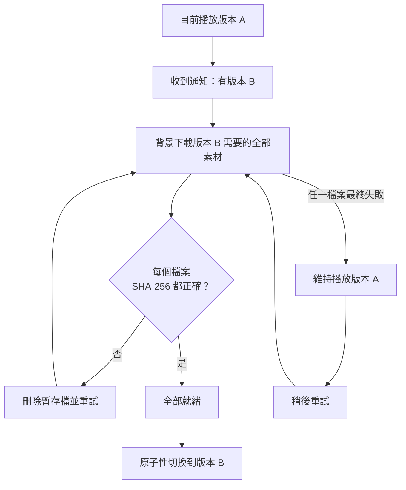

# 離線播放

這是 HUAN 最重要的一項行為。

## 保證

**網路斷線時，HUAN 繼續播放目前的內容。**

不會有這種事：

```text
網路斷線
	↓
黑畫面
```

一面看板的價值就是它一直亮著。客戶不會知道是網路的問題，他們只會看到自己花錢買的螢幕變成一塊黑板。

## 為什麼做得到

素材永遠**先下載到裝置本機**才播放。正常播放時裝置完全不需要網路——它讀的是自己硬碟上的檔案。

排程清單也存在本機，因此時段切換也不需要 Server。

網路只負責一件事：告訴裝置「內容變了」。這件事延遲幾分鐘、幾小時，甚至幾天，都不影響現在正在播的畫面。

理由見 [ADR-0005](/dev/adr/0005-local-first-playback)。

## 更新怎麼進行



關鍵在於：**版本 A 全程都在播。**

- 下載期間播 A
- 驗證期間播 A
- 任何一個檔案失敗，就繼續播 A
- 只有全部就緒才切到 B

**絕對不會先刪除版本 A 的檔案再下載版本 B。** 舊版本的素材要等新版本成功啟用並經過保留期之後才會被回收。

## 校驗

每個檔案都用 SHA-256 驗證：

```text
下載到 .part 暫存檔（邊寫邊算雜湊）
	↓
比對 manifest 裡的值
	↓
符合 → rename 成正式檔名 → 回報 ACK
不符 → 刪除暫存檔 → 重試
```

雜湊不符時**絕不回報 ACK**。回報一個其實沒下載成功的檔案，會讓 Server 以為可以回收派送產物——那才是真正無法挽回的錯誤。

## 重新連線

WebSocket 斷線後以指數退避加抖動重連：

```text
1s → 2s → 4s → 8s → 16s → 30s → 60s（上限）
```

每次等待時間都加上隨機抖動。整個賣場的看板同時斷線時，沒有抖動就會在同一秒一起重連，把剛恢復的 Server 再打掛一次。

即使 WebSocket 正常，裝置仍然每 5 分鐘做一次完整狀態同步，不完全依賴推播。

## 斷電之後

所有本機狀態的寫入都是原子的：先寫暫存檔、`fsync`、再 `rename`。

看板通常裝在牆上，沒有 UPS，斷電是常態而不是意外。半寫入的 manifest 會讓裝置開機後不知道自己該播什麼——原子寫入讓這件事不可能發生。

重新開機後：

```text
載入最後一份已知良好的狀態
	↓
繼續播放
	↓
在背景重新連線 Server
```

**開機不需要 Server 在線。**

## 儲存空間

裝置有本機快取上限。空間不足時：

1. 先回收未被引用的舊素材
2. 仍然不足就向 Server 回報儲存錯誤，後台會顯示

回收**永遠不會刪除**：

- 目前啟用版本的素材
- 下一個排程版本需要的素材
- 正在下載中的檔案

## 下載節流

裝置同時最多下載 2 到 3 個檔案，不會一次抓五十支影片把現場網路塞死。

已經存在且雜湊正確的檔案會直接跳過，重新開機不會重下載一輪。伺服器支援 `Range` 時可以續傳。

簽章網址過期時裝置會重新索取，**不會讓整次同步失敗**。
