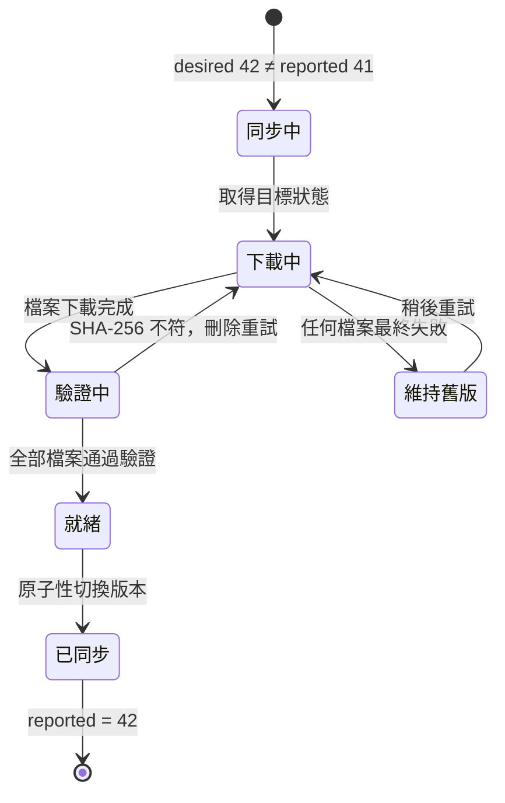

這是 HUAN 最核心的同步模型。

## 模型

Server 不對裝置下命令，而是宣告一個**目標**：

```json
{
	"deviceId": "…",
	"version": 42,
	"defaultLayout": { "revisionId": "…", "document": { … } },
	"schedules": [ … ],
	"assets": [ { "assetId": "…", "sha256": "…", "downloadPath": "…" } ]
}
```

裝置回報一個**現況**：

```json
{
	"desiredVersion": 41,
	"currentLayoutRevisionId": "…",
	"readyAssetIds": [ … ],
	"pendingAssetIds": [ … ],
	"diskFreeBytes": 12884901888
}
```

差異由裝置自己彌平：下載、驗證、啟用、回報。



## 為什麼不用命令式 RPC

想像一下命令式的版本：Server 送出「下載這個檔案」、「切換到那個版面」、「重新啟動播放器」。

那麼裝置在下載到一半時斷電，會發生什麼事？Server 以為指令送出去了，裝置醒來卻不知道自己該做什麼。Server 得記住每一條指令送到哪一步、哪些成功、哪些要重送——這就是在資料庫裡重新發明一套不可靠的工作流程引擎。

宣告式模型讓這個問題消失。裝置重新開機後只要做一件事：比較目標與現況，然後把差距補上。中間斷過幾次、重試過幾輪，都不影響最終結果。

完整理由見 [ADR-0002](/dev/adr/0002-desired-reported-state)。

## 版本號

`desiredVersion` 是每台裝置各自的單調遞增整數。

Server 在下列情況重算目標狀態：

- 裝置完成配對
- 版面發布新的修訂
- 排程建立、修改或刪除
- 裝置的預設版面改變

重算之後**只有內容真的不同**才會遞增版本號。這一點很重要：如果每次重算都遞增，改一個不相干的排程就會讓一百台裝置全部誤以為自己落後，然後同時來要狀態。

## 原子性切換

新版本必須**全部**準備好才能啟用：

1. 下載版本 B 需要的每一個檔案
2. 逐一驗證 SHA-256
3. 全部通過後，寫入新的 `manifests/active.json` 並切換播放器

在這整段期間，版本 A 一直在播。任何一個檔案失敗，裝置就留在版本 A 並稍後重試。

**絕對不會先刪除版本 A 的檔案再下載版本 B。** 舊版本的素材要等新版本成功啟用並經過保留期之後才會被回收。

## Heartbeat 回報什麼

| 欄位                                | 說明                                                |
| ----------------------------------- | --------------------------------------------------- |
| `desiredVersion`                    | 裝置目前已啟用的版本                                |
| `appVersion` / `protocolVersion`    | 用於相容性判斷                                      |
| `platform` / `arch` / `osVersion`   | 平台資訊                                            |
| `displays`                          | 每個顯示器的解析度、縮放與方向                      |
| `currentLayoutRevisionId`           | 現在正在播的版面修訂                                |
| `currentScheduleId`                 | 命中的排程，沒有排程時為 `null`                     |
| `readyAssetIds` / `pendingAssetIds` | 同步進度                                            |
| `diskFreeBytes` / `diskTotalBytes`  | 儲存空間                                            |
| `temperatureCelsius`                | Raspberry Pi 取得得到；Windows 與 macOS 回報 `null` |
| `uptimeSeconds` / `lastSyncAt`      | 運作時間與最後同步時間                              |
| `storageError`                      | 空間不足或寫入失敗時的說明                          |

取不到的欄位一律回報 `null`。HUAN 不會為了讓型別好看而填假數值——後台顯示「—」比顯示一個編出來的溫度誠實得多。
