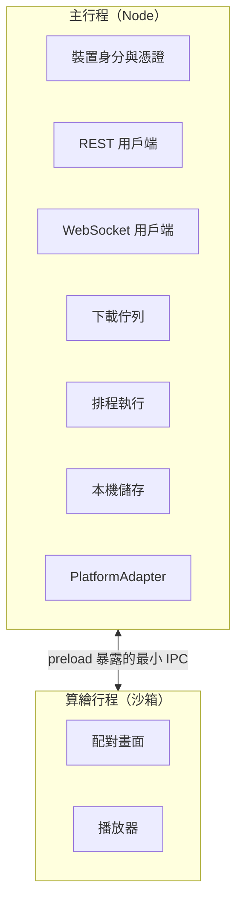

Electron 播放器。同一份程式碼跑在 Raspberry Pi、Ubuntu、Windows 與 macOS 上。

## 行程分工



主行程掌握所有敏感能力。算繪行程只知道「現在要畫什麼」。

## 安全設定

```ts
{
	nodeIntegration: false,
	contextIsolation: true,
	sandbox: true
}
```

這三個設定不會為了任何功能而放寬。

preload 只暴露必要的幾個方法（取得目前版面、回報播放錯誤、取得裝置資訊、觸發解除綁定），而且每一個都經過結構驗證。

### 上傳的 HTML

使用者上傳的 HTML 在**再一層** sandbox iframe 裡執行，透過自訂協定從本機讀取，並套用嚴格的 CSP。

它拿不到 `require`、拿不到檔案系統、拿不到 Electron API、也拿不到 preload 暴露的介面。

「因為要播放 HTML 所以把 Electron 的安全設定關掉」是絕對不會發生的事。

## 本機儲存

```text
appData/
├─ config/     裝置身分、伺服器位址
├─ state/      目標狀態、回報狀態、啟用中的版本
├─ media/      已驗證的播放檔
├─ manifests/  active.json、pending.json
└─ logs/
```

所有寫入都是原子的：先寫 `.tmp`、`fsync`、再 `rename`。

看板通常裝在牆上，沒有 UPS，斷電是常態而不是意外。半寫入的 manifest 會讓裝置開機後不知道自己該播什麼——原子寫入讓這件事不可能發生。

讀取遇到缺檔或損毀時回傳 `null` 並記錄，**不會拋例外把播放器弄掛**。

## 下載

- 同時最多 2 到 3 個檔案。不會一次抓五十支影片把現場網路塞死。
- 下載到 `.part` 暫存檔，邊寫邊算 SHA-256。
- 雜湊符合才 `rename` 成正式檔名，然後才 ACK。
- **雜湊不符時刪除暫存檔並重試，絕不 ACK。**
- 簽章網址過期時重新向 Server 索取，不會讓整次同步失敗。
- 已經存在且雜湊正確的檔案直接跳過，重開機不會重下載一輪。
- 伺服器支援 `Range` 時可以續傳。

## 儲存空間管理

下載前先檢查剩餘空間。不足時先回收未被引用的檔案；仍然不足就向 Server 回報 `storageError`，讓後台顯示出來。

回收**永遠不會刪除**：

- 目前啟用版本的素材
- 下一個排程版本需要的素材
- 正在下載中的檔案

## PlatformAdapter

平台差異集中在一個介面裡：

```ts
interface PlatformAdapter {
	getDisplays(): Promise<DisplayInfo[]>;
	getDiskInfo(): Promise<DiskInfo>;
	getTemperature(): Promise<number | null>;
	getUptime(): Promise<number>;
}
```

`LinuxAdapter`、`WindowsAdapter`、`MacOSAdapter` 各自實作，核心程式碼完全不需要出現 `if (process.platform === "win32")`。

裝置**不可以假設**系統上一定有 `apt`、`vcgencmd` 或 `systemd`。Raspberry Pi 上讀得到 CPU 溫度，Windows 上讀不到就回報 `null`——不為了型別好看而編一個數字。

## 本機介面

未綁定時顯示配對畫面：品牌、`XXXX-XXXX` 配對碼與 QR Code。

綁定後直接進入播放器，預設全螢幕 kiosk 模式，不顯示作業系統桌面。

**綁定後不能在裝置本機修改版面、素材或排程。** 本機只提供：

- 裝置基本資訊
- 網路與連線狀態
- 配對狀態
- 解除綁定

透過系統匣、選單或鍵盤快捷鍵開啟，不影響正常播放。

## 解除綁定

解除綁定需要二次確認，之後：

1. 撤銷本機憑證
2. 清除帳戶綁定與目標狀態
3. 回到配對畫面

離線時解除綁定也會**立即生效**：本機馬上停止接受帳戶控制，並保留一個待撤銷狀態，下次連上線時完成伺服器端的撤銷。

待撤銷狀態不會因為收到過期的伺服器回應而被還原——已經解除的綁定不會自己恢復。

## 崩潰後復原

裝置重新啟動後：

```text
載入最後一份已知良好的狀態
  ↓
繼續播放
  ↓
在背景重新連線 Server
```

**開機不需要 Server 在線。** 這是離線優先設計的必然結果，也是驗收時一定要測的一項。
