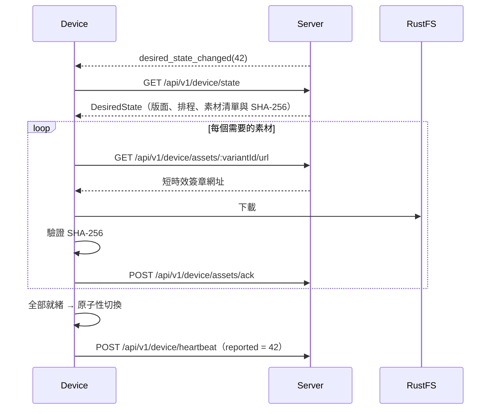

Admin、Server、Worker 與 Device 共用 `@huan/protocol` 的結構定義。**型別只定義一次。**

## API 版本

所有 REST 端點掛在 `/api/v1` 之下：

```ts
import { API_PREFIX, PROTOCOL_VERSION } from "@huan/protocol";
```

`PROTOCOL_VERSION` 是裝置與 Server 之間的通訊協定版本，裝置在 WebSocket handshake 與 heartbeat 中回報，Server 用它判斷相容性。

## 認證

| 對象   | 方式                                                                               |
| ------ | ---------------------------------------------------------------------------------- |
| 瀏覽器 | `Cookie: huan_session=<不透明 token>`（HttpOnly、SameSite=Lax、正式環境加 Secure） |
| 裝置   | `Authorization: Bearer <deviceId>.<secret>`                                        |

## 錯誤

所有錯誤回應共用同一個結構：

```ts
{ code: string, message: string, details?: Record<string, unknown> }
```

`code` 是穩定的機器可讀識別字，`message` 是使用者可讀的繁體中文說明。

常見的 `code`：`unauthorized`、`forbidden`、`not_found`、`validation_failed`、`rate_limited`、`totp_required`、`invalid_credentials`、`conflict`、`asset_in_use`、`asset_unavailable`、`pairing_expired`。

## OpenAPI

規格由 zod 結構**自動產生**，不是人工維護的第二份文件：

| 端點                       | 說明                          |
| -------------------------- | ----------------------------- |
| `GET /api/v1/openapi.json` | 原始規格                      |
| `GET /api/v1/docs`         | 互動式 API 文件（非正式環境） |

因此 API 文件不可能和實作不同步——它們是同一份結構的兩種輸出。

## WebSocket

### 裝置通道 `/api/v1/devices/socket`

Server 送出：

```ts
{
	type: "hello";
	serverTime;
	protocolVersion;
	desiredVersion;
}
{
	type: "desired_state_changed";
	version: number;
}
{
	type: "command";
	commandId: string;
	command: "force_sync" | "restart_player" | "unbind";
}
{
	type: "pong";
	serverTime;
}
```

裝置送出：

```ts
{ type: "ping" }
{ type: "heartbeat"; reported: ReportedState }
{ type: "command_result"; commandId: string; ok: boolean; message?: string }
```

**WebSocket 不傳輸任何素材。** 它只說「有東西變了」，真正的狀態一律回到 REST 取得（[ADR-0001](/dev/adr/0001-websocket-plus-rest)）。

每一個進來的訊框都用結構驗證。不合法的訊框會被丟棄並記錄，**不會拋例外**。

### 後台通道 `/api/v1/admin/socket`

以 session cookie 認證，推播 `device_changed` 與 `media_changed`，讓後台不需要重新整理就能看到裝置上下線與轉檔完成。

## 裝置同步



簽章網址**不會寫進目標狀態**，因為目標狀態會被快取在裝置本機，而簽章網址只有 15 分鐘的壽命。裝置在需要下載時才即時索取。

## 相容性

- REST 走路徑版本（`/api/v1`）。破壞性的變更會開 `/api/v2`。
- WebSocket 訊息以 `type` 做可辨識聯集，新增訊息類型不會影響舊裝置——它們會驗證失敗並丟棄，而不是崩潰。
- 裝置回報 `appVersion` 與 `protocolVersion`，Server 可以據此拒絕或降級處理過舊的裝置。
- 新增的欄位一律是選填，或帶有預設值。
