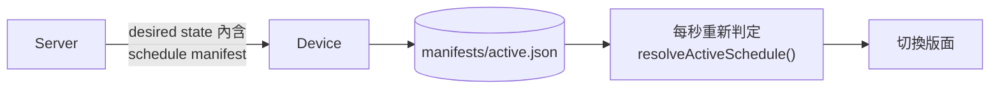

## 排程長什麼樣

一筆排程描述「在哪些日子的哪個時段，哪些裝置該播哪個版面」。

| 欄位                    | 說明                                         |
| ----------------------- | -------------------------------------------- |
| `layoutId`              | 要播的版面。實際派送的是它目前已發布的修訂。 |
| `timezone`              | IANA 時區，例如 `Asia/Taipei`。              |
| `priority`              | 數字愈大愈優先。                             |
| `startDate` / `endDate` | 生效的日期區間，可留空表示不限。             |
| `daysOfWeek`            | 星期幾生效，0 是星期日。                     |
| `startTime` / `endTime` | `HH:MM`。結束早於或等於開始時代表跨午夜。    |
| `deviceIds`             | 目標裝置。                                   |

典型的用法：

```text
星期一至五 08:00–11:00  早餐版面
星期一至五 11:00–14:00  午餐版面
星期一至五 14:00–17:00  下午茶版面
```

沒有任何排程命中的時段，裝置播放它的**預設版面**；連預設版面都沒有時顯示待命畫面。

## 時區必須存 IANA 名稱

排程存的是 `Asia/Taipei`，不是 UTC+8，也不是 Server 的本機時區。

理由很簡單：UTC 偏移會變，時區不會。一個設在 `America/New_York` 早上八點的排程，在三月和十一月對應到不同的 UTC 時刻。如果只存「UTC 13:00」，日光節約時間切換的那個週末，看板就會在錯誤的時間換畫面。

判定完全建立在**牆上時間**之上：

```ts
const wall = toWallClock(instant, entry.timezone);
// { date: "2026-03-02", time: "08:30", weekday: 1 }
```

平台的時區資料庫負責換算，HUAN 只比較「當地現在幾點」。日光節約時間、半小時偏移的時區、南半球的反向切換，全都自動正確。

不存在的當地時刻（日光節約時間往前跳過的那一小時）在那一天就是不會命中——這是刻意的行為，而不是靜默地播錯東西。

## 跨午夜

`endTime` 小於或等於 `startTime` 時代表視窗跨過午夜。

視窗**錨定在開始的那一天**：

```text
星期一 22:00–02:00
= 星期一晚上十點  →  星期二凌晨兩點
```

星期二凌晨一點會命中（因為它屬於星期一開始的視窗），星期三凌晨一點則不會（星期二晚上沒有排程）。

## 衝突怎麼決勝

兩筆排程同時生效時，依序比較下列條件，直到分出勝負：

1. **`priority` 較大**的勝出。
2. **每日視窗較短**的勝出。愈短代表指定得愈精確，適合用來覆蓋長時段的底圖。
3. **指定天數較少**的勝出。
4. **有日期區間**的勝過沒有日期區間的。
5. **`updatedAt` 較新**的勝出。
6. 以 **`id` 字典序**作為最後的決勝。

最後一條的存在是為了讓結果**永遠是決定性的**。兩筆條件完全相同的排程不會隨機挑一筆——同一組輸入永遠得到同一個答案，不管你把它們用什麼順序傳進來。

實務上的用法：

```text
priority 100  星期一至五 08:00–18:00  一般營業版面
priority 500  星期一至五 12:00–12:30  午間限時活動  ← 勝出
```

## 離線執行

裝置會把**排程清單本身**下載下來，存在 `manifests/` 底下。



判定完全在本機進行，用的是和 Server 完全相同的 `resolveActiveSchedule()`。因此：

**Server 離線時，裝置依然會照時間切換版面。**

裝置不會在每個時間點去問 Server「現在要播什麼」。那種設計在網路正常時很優雅，網路一斷就整個停擺——而數位看板最常出問題的地方就是網路。

判定是純計算（一次 `Intl.DateTimeFormat` 加幾個字串比較），因此裝置每秒重算一次，切換誤差不超過一秒，成本可以忽略。
