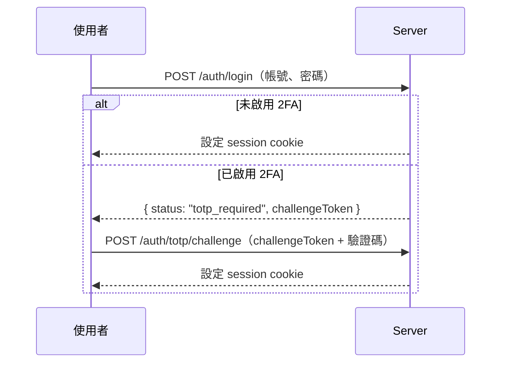

Fastify 5，TypeScript，PostgreSQL。

## 結構

```text
apps/server/src/
	main.ts          進入點
	app.ts           buildServer()，測試也用同一個組裝函式
	env.ts           以 @huan/config 驗證環境變數
	plugins/         cookie、cors、rate limit、websocket、swagger、static、錯誤處理
	lib/             認證、密碼、session、TOTP、儲存、稽核、目標狀態計算
	routes/          依領域切分的路由
	ws/              裝置與後台的 WebSocket 端點
	cli/             migrate、seed、create-admin
```

## 結構驗證與 OpenAPI

每一條路由的請求與回應都用 `@huan/protocol` 的 zod 結構驗證，OpenAPI 文件由**同一份結構**自動產生。

這表示 API 文件不可能和實作不同步——它們是同一個東西的兩種輸出。

開發模式下可以在 `/api/v1/docs` 瀏覽，`/api/v1/openapi.json` 取得原始規格。

## 認證

### 密碼

Argon2id。系統中沒有任何地方保存明文密碼，也沒有任何可逆的表示法。

### Session

登入成功後產生一組隨機的不透明 token，放進 `HttpOnly`、`SameSite=Lax` 的 cookie（正式環境加上 `Secure`）。

資料庫只存這個 token 的 SHA-256。資料庫外洩時拿不到可用的 token，撤銷也只是刪掉一列資料。

:::tip[為什麼 session token 用 SHA-256 而不是 Argon2]

Argon2 是為了對抗**低熵**密碼的暴力破解而設計的慢雜湊。Session token 是密碼學隨機產生的 256 bit 值，沒有暴力破解的可能性，用慢雜湊只會讓每一次請求都多花數十毫秒。

:::

長期憑證絕不放在 `localStorage`——那裡的東西任何一段跑在同源的 JavaScript 都讀得到。

### 兩步驟驗證

啟用 TOTP 後，登入分成兩段：



`challengeToken` 是短時效、一次性的中繼憑證，**不能存取任何 API**，只能用來完成第二階段。

TOTP 遵循 RFC 6238，容忍前後各一個時間步長的時鐘誤差，並記錄上次成功的時間步長以拒絕同一組驗證碼的重放。實作有 RFC 4226 與 RFC 6238 官方測試向量的單元測試。

TOTP 密鑰只在啟用流程回傳一次，之後不會出現在任何 API 回應或日誌中。

### 復原碼

啟用 2FA 時產生 10 組復原碼，**只顯示一次**。Server 只保存雜湊，使用後立即失效。

### 速率限制

每次登入嘗試都寫進 `login_attempts`。同一組帳號或同一個來源 IP 在時間窗內失敗次數超過上限就會被擋下。

紀錄寫在資料庫而不是記憶體，因此重啟 Server 不會把攻擊者的計數歸零。

## 角色

只有兩種角色：

| 角色          | 權限                                           |
| ------------- | ---------------------------------------------- |
| `super_admin` | 管理使用者、所有裝置、查看稽核紀錄             |
| `user`        | 操作素材、版面、排程與裝置，不能管理其他使用者 |

**沒有公開註冊。** 第一個管理員由 CLI 建立，之後的使用者由 `super_admin` 在後台建立。

## 健康檢查

| 端點                | 檢查內容                         |
| ------------------- | -------------------------------- |
| `GET /health/live`  | 永遠 200，只證明 process 還活著  |
| `GET /health/ready` | 檢查 PostgreSQL 連線，失敗回 503 |

RustFS 刻意**不列入** readiness。物件儲存暫時不可用時，Server 仍然能提供後台 API 與裝置的目標狀態，裝置也能繼續播放本機已有的內容；把整個服務標成 not ready 只會讓負載平衡器把它從輪替中移除，讓情況更糟。上傳與下載會在當下回報明確的錯誤。

## 稽核紀錄

所有重要操作都會留下紀錄：登入、登入失敗、啟用與停用 2FA、建立與停用使用者、裝置配對與解除綁定、發布版面、修改排程、刪除素材、強制同步。

每筆紀錄包含操作者、動作、目標、時間與來源 IP。

**絕不寫入**密碼、TOTP 密鑰、復原碼、session token、裝置憑證或簽章網址的查詢字串。
