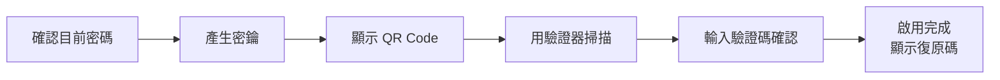

每位使用者都可以在 `/app/security` 為自己的帳號啟用 TOTP 兩步驟驗證。

<figure class="huan-figure">
	
	<figcaption>安全設定：兩步驟驗證與工作階段</figcaption>
</figure>

## 啟用



1. 進入 `/app/security`，按下啟用。
2. **輸入目前的密碼。** 這一步是為了避免有人趁你離開座位時把自己的驗證器綁上去。
3. 用驗證器 App 掃描 QR Code，或手動輸入顯示的密鑰。
4. 輸入驗證器產生的六位數驗證碼確認。
5. 記下畫面顯示的復原碼。

支援任何符合 RFC 6238 的驗證器：Google Authenticator、1Password、Bitwarden、Aegis、Authy 等等。

## 復原碼

啟用時會產生 10 組復原碼。

:::warning[只會顯示一次]

離開這個畫面之後就再也看不到了。Server 只保存雜湊，任何人都無法還原。

:::

請把它們存在密碼管理器或列印下來收好。每一組只能使用一次。

用完或遺失時可以重新產生一批——舊的會全部失效。

## 登入流程

啟用之後：

```text
輸入帳號密碼
	↓
沒有 2FA → 直接登入
	↓
有 2FA → 輸入驗證碼 → 登入
```

第二階段使用的是短時效、一次性的中繼憑證，**不能存取任何 API**，只能用來完成驗證。

## 時鐘誤差

驗證會容忍前後各一個時間步長，也就是大約 ±30 秒的裝置時鐘誤差。

驗證碼一直被拒絕時，先檢查手機的時間是不是設成自動同步。

同一組驗證碼不能用第二次——Server 記錄了上次成功的時間步長。

## 停用

需要同時提供目前的密碼與一組有效的驗證碼。

## 工作階段

安全設定頁面列出所有登入中的工作階段：建立時間、最後活動時間、來源 IP 與瀏覽器，目前這一個會被標示出來。

可以個別撤銷。撤銷是立即生效的——被撤銷的工作階段下一次請求就會被拒絕。

## 一件不會發生的事

TOTP 密鑰只在啟用流程回傳一次。之後它不會出現在任何 API 回應、任何日誌、任何稽核紀錄裡。
